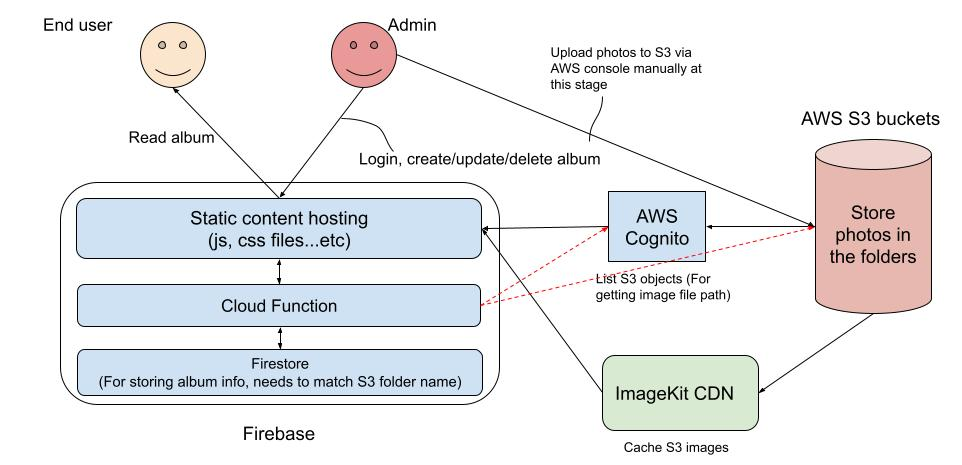

# Quasar S3 photo albums web app (integrate with ImageKit Image CDN and Google Firebase)

This is a simple AWS S3 album app by using Vue3, Quasar and AWS SDK. You can use this web app to display your photos in S3 bucket.
Since displaying photos from S3 directly only has limited functionality (you can only display folder name as album name), I use Google Cloud Firestore to organise
my S3 photo folder information as well as deploy my project to Google Cloud Firebase.

## Getting started
### Create S3 bucket and Cognito Identity Pool
Before you start, please create an AWS S3 bucket and an AWS Cognito Identity Pool at first [1]. Once you create them, replace those properties:
AWS_S3_BUCKET_NAME, AWS_REGION, AWS_IDENTITY_POOL_ID and IMAGEKIT_CDN_URL with your real information in`quasar.conf.js` (under `build -> env` section) then you are good to go.
The file structure in the S3 bucket should be like this:
```
/S3 bucket:
  | => album folder A/
         | => photo file A
         | => photo file B
  | => album folder B/
         | => photo file A
         | => photo file B
```

### S3 bucket policy
You usually want to make your S3 albums public so that your friends can see it, you need to add `getObject` in the bucket policy (under `Permissions` tab):
```json
{
    "Version": "2012-10-17",
    "Id": "Policy1548223592786",
    "Statement": [
        {
            "Sid": "Stmt1548223591553",
            "Effect": "Allow",
            "Principal": "*",
            "Action": "s3:GetObject",
            "Resource": "arn:aws:s3:::{YOUR_S3_BUCKET}/*"
        }
    ]
}
```

### S3 static website
If you want to place this Vue app in the S3 bucket along with your photos, you need to make your S3 bucket as a web server
to serve your js, css, font... etc files[2]. If you want to configure your S3 bucket as a static website using a custom domain,
you can check out this [documentation](https://docs.aws.amazon.com/AmazonS3/latest/userguide/website-hosting-custom-domain-walkthrough.html).

### Deploy to Firebase (recommended)
Because I don't want to deal with SSL on my project (I am too lazy to configure AWS CDN...etc `¯\_(ツ)_/¯` ), I deploy my project to Google Firebase
and Google will do all SSL configuration for me.
* Visit `https://console.firebase.google.com` to create a new project
* Check [here](https://firebase.google.com/docs/hosting/quickstart) for further detail about how to deploy your app to Firebase
* You can run this command to deploy your project locally: `npm run firebase-deploy`

### S3 CORS policy
Don't forget to put CORS into S3 bucket configuration[3] to prevent other people link your photos from their websites directly.
No matter where you deploy your app (AWS or Google Firebase), you should add those URLs for hosting your website into CORS configuration.
For example:
```json
[
    {
        "AllowedHeaders": [
            "*"
        ],
        "AllowedMethods": [
            "GET"
        ],
        "AllowedOrigins": [
            "http://www.example1.com"
        ],
        "ExposeHeaders": []
    }
]
```

### Integrate with ImageKit
In order to reduce the traffic with S3 buckets (to save money!), this project integrate with ImageKit CDN. ImageKit.io
is a cloud-based image CDN with real-time image optimization and transformation features that help you deliver perfectly
optimized images across all devices[4]. You can follow this [documentation](https://imagekit.io/blog/image-optimization-resize-aws-s3-imagekit/)
to create an account in the ImageKit. You will have 20GB bandwidth per month as a free user.

#### Important
If you change S3 bucket name, don't forget to update the configuration in ImageKit, AWS IAM permission for Cognito and Imagekit.

### Google Cloud Firestore
As I mentioned, I use [Google Cloud Firestore](https://firebase.google.com/docs/firestore) to organise my S3 photo folders information. I ran a small script to fetch
all folders in S3 bucket and inserted folder name along with other information into Google Firestore. The album object structure as below:
```
Album
{
  albumName: string;
  desc: string;
  tags: string[];
  private: boolean;
}
```
Architecture:


### Install the dependencies
```bash
npm install
```

### Start the app in development mode (hot-code reloading, error reporting, etc.)
```bash
quasar dev
or
npm run serve
```

### Lint the files
```bash
npm run lint
```

### Build the app for production
```bash
quasar build
or
npm run build
```

### Deploy to Google Firebase
```
npm run firebase-deploy
```

### Customize the configuration
See [Configuring quasar.conf.js](https://v2.quasar.dev/quasar-cli/quasar-conf-js).

### References
1. [Viewing Photos in an Amazon S3 Bucket from a Browser](https://docs.aws.amazon.com/sdk-for-javascript/v2/developer-guide/s3-example-photos-view.html)
2. [Enabling website hosting](https://docs.aws.amazon.com/AmazonS3/latest/userguide/EnableWebsiteHosting.html)
3. [CORS Configuration](https://docs.aws.amazon.com/AmazonS3/latest/userguide/ManageCorsUsing.html)
4. [Optimize and resize images in AWS S3 in real-time with ImageKit](https://imagekit.io/blog/image-optimization-resize-aws-s3-imagekit/)
