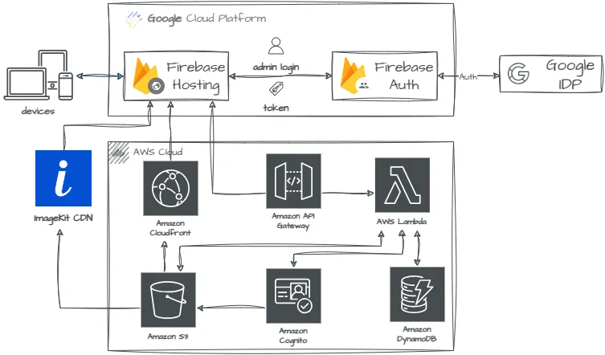

# Quasar S3 photo albums web app

This is a simple AWS S3 album app by using Vue3, Quasar, Google Firebase hosting and AWS (including API Gateway, Lambda
function, S3 and dynamoDB). You can use this web app to display your photos in S3 bucket. Since displaying photos
from S3 directly only has limited functionality (you can only display folder name as album name), I use AWS DynamoDB to
organise S3 photo folders information.

## Getting started
### Create S3 bucket and Cognito Identity Pool
Before you start, please create an AWS S3 bucket and an AWS Cognito Identity Pool at first [1]. Once you create them, replace those properties:
STATIC_FILES_URL, AWS_REGION, AWS_IDENTITY_POOL_ID and IMAGEKIT_CDN_URL with your real information in`.env.example` and modify file name to `.env` then you are good to go.
The file structure in the S3 bucket should be like this:
```
my-photo-S3-bucket/
 +- photo-alubm-a/     # Directory containing your photos
      |
      +- photo-a-1.jpg
      |
      +- photo-a-2.jpg
 +- photo-alubm-b/     # Directory containing your photos
      |
      +- photo-b-1.jpg
      |
      +- photo-b-2.jpg
```

### S3 bucket policy
You usually want to make your S3 albums public so that your friends can see it, you need to add `getObject` in the bucket policy (under `Permissions` tab):
```json
{
    "Version": "2012-10-17",
    "Id": "Policy1548223592786",
    "Statement": [
        {
            "Sid": "Stmt1548223591553",
            "Effect": "Allow",
            "Principal": "*",
            "Action": "s3:GetObject",
            "Resource": "arn:aws:s3:::{YOUR_S3_BUCKET}/*"
        }
    ]
}
```

### S3 CORS policy
Don't forget to put CORS into S3 bucket configuration[3] to prevent other people link your photos from their websites directly.
No matter where you deploy your app (AWS or Google Firebase), you should add those URLs for hosting your website into CORS configuration.
For example:
```json
[
    {
        "AllowedHeaders": [
            "*"
        ],
        "AllowedMethods": [
            "GET"
        ],
        "AllowedOrigins": [
            "http://www.example1.com"
        ],
        "ExposeHeaders": []
    }
]
```

### Architecture


### Integrate with ImageKit
In order to reduce the traffic with S3 buckets (to save money!), this project integrate with ImageKit CDN. ImageKit.io
is a cloud-based image CDN with real-time image optimization and transformation features that help you deliver perfectly
optimized images across all devices[4]. You can follow this [documentation](https://imagekit.io/blog/image-optimization-resize-aws-s3-imagekit/)
to create an account in the ImageKit. You will have 20GB bandwidth per month as a free user.

#### Important
If you change S3 bucket name, don't forget to update the configuration in ImageKit, AWS IAM permission for Cognito and Imagekit.

### S3 static website
If you want to place this Vue app in the S3 bucket along with your photos, you need to make your S3 bucket as a web server
to serve your js, css, font... etc files[2]. If you want to configure your S3 bucket as a static website using a custom domain,
you can check out this [documentation](https://docs.aws.amazon.com/AmazonS3/latest/userguide/website-hosting-custom-domain-walkthrough.html).

### Deploy to Firebase hosting
Because I don't want to deal with SSL and CDN on my project, I deploy my project to Google Firebase and Google will do all SSL configuration for me.
* Visit `https://console.firebase.google.com` to create a new project
* Check [here](https://firebase.google.com/docs/hosting/quickstart) for further detail about how to deploy your app to Firebase
* You can run this command to deploy your project locally: `npm run firebase-deploy`
* Place your Google Firebase information in the `.env` too

### AWS Lambda Function
I use AWS Lambda Function to handle all APIs (as BFF, backend for frontend) and authentication process so that I can
manage user's cookies, which I can use to against admin actions such as update album, delete album from AWS DynamoDB
as well as uploading photos to AWS S3 bucket.

### AWS DynamoDB
As I mentioned, I use [AWS DynamoDB](https://docs.aws.amazon.com/dynamodb/index.html) to organise my S3 photo
folders information. The photo album object structure as below:
```
id: string => it is the same as the folder name in s3
albumName: string
albumCover: string
description: string
tags: string[]
isPrivate: boolean
order: number
createdAt: string (Date time)
updatedAt: string (Date time)
createdBy: string (email)
updatedBy: string (email)
```

### Upload photos to AWS S3 bucket
I use AWS Cognito identity pool to provide temporary credentials to access AWS S3 bucket for anonymous guest users. For signed-in users,
I use AWS IAM to create a role and attach the appropriate policy to the role. Then I use AWS credentials to access AWS S3 bucket.
Before uploading photos to AWS S3 bucket via AWS Lambda Function, we need to set up AWS Cognito identity pool and IAM properly.
Make sure attaching correct permissions to the [IAM role](https://docs.aws.amazon.com/cognito/latest/developerguide/security_iam_service-with-iam.html)
which is used by AWS Cognito identity pool and use the [credential](https://docs.aws.amazon.com/cognito/latest/developerguide/getting-credentials.html)
to access AWS S3 client.

### Install the dependencies
```bash
npm install
```

### Start the app in development mode (hot-code reloading, error reporting, etc.)
```bash
$ quasar dev
or
$ npm run serve
```

### Lint the files
```bash
$ npm run lint
```

### Build the app for production
```bash
$ quasar build
or
$ npm run build
```

### Deploy Quasar web app to Google Firebase Hosting
```bash
$ npm run firebase:deploy
```

### Run AWS Lambda Function locally
```bash
$ cd lambda
$ npm run start:server
```

### Deploy to AWS Lambda Function
```bash
$ cd lambda
$ npm run deploy:lambda
```

### Customize the Quasar configuration
See [Configuring quasar.conf.js](https://v2.quasar.dev/quasar-cli/quasar-conf-js).

### References
1. [Viewing Photos in an Amazon S3 Bucket from a Browser](https://docs.aws.amazon.com/sdk-for-javascript/v2/developer-guide/s3-example-photos-view.html)
2. [Enabling website hosting](https://docs.aws.amazon.com/AmazonS3/latest/userguide/EnableWebsiteHosting.html)
3. [CORS Configuration](https://docs.aws.amazon.com/AmazonS3/latest/userguide/ManageCorsUsing.html)
4. [Optimize and resize images in AWS S3 in real-time with ImageKit](https://imagekit.io/blog/image-optimization-resize-aws-s3-imagekit/)
