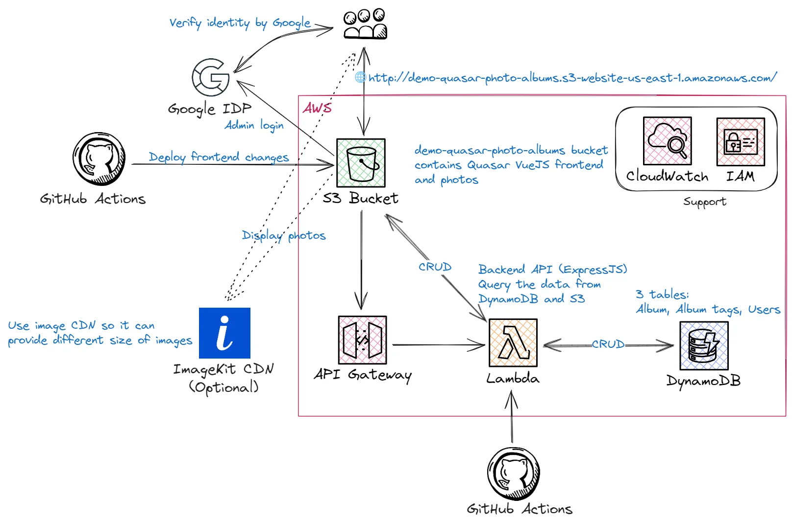
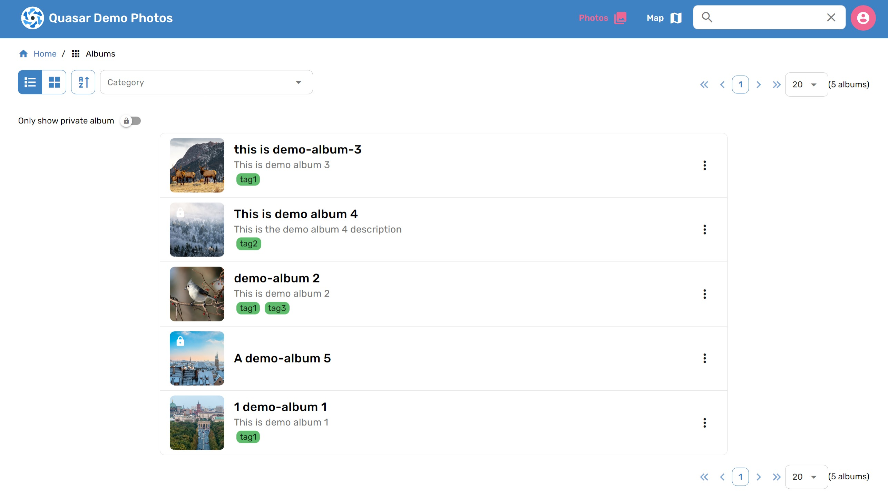
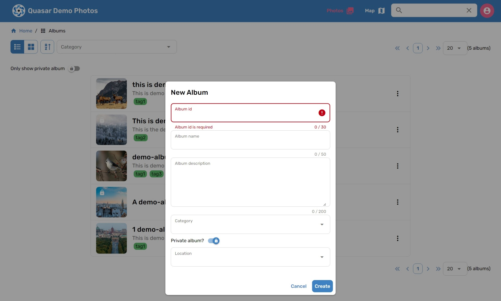
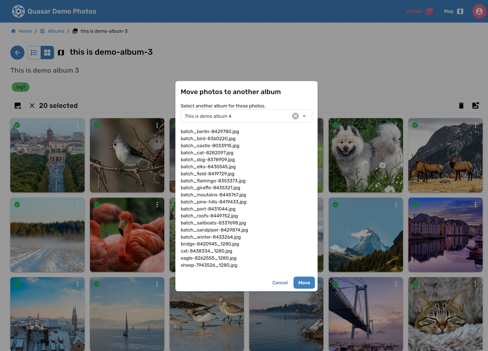
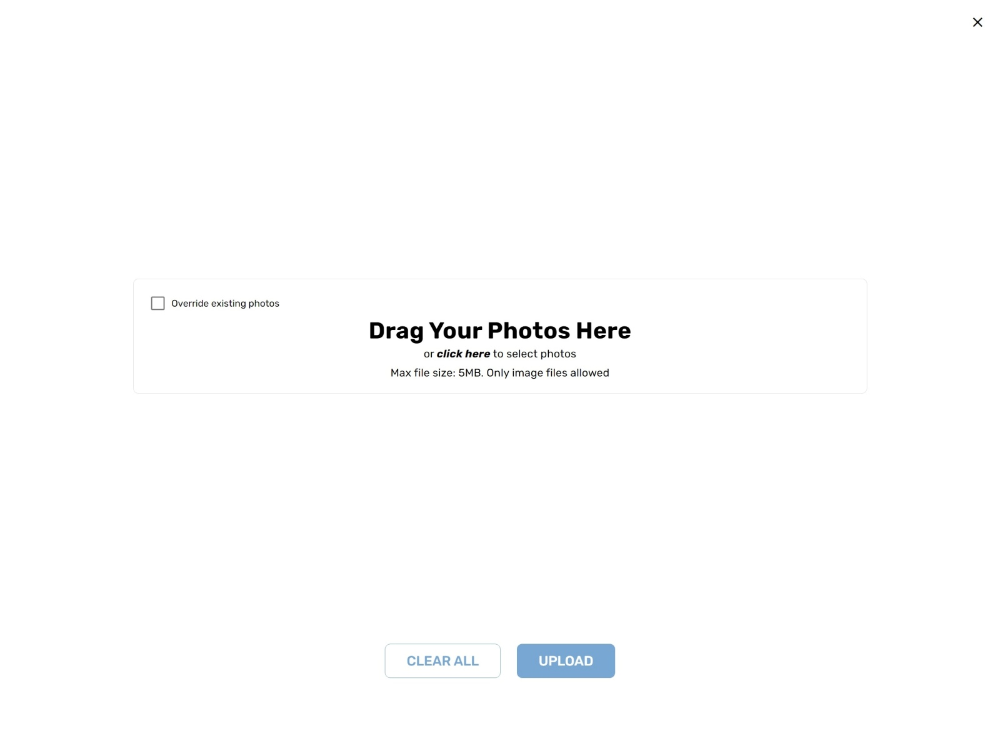

# Quasar S3 photo albums web app

<!-- TABLE OF CONTENTS -->
<details>
  <summary>Table of Contents</summary>
  <ol>
    <li>
      <a href="#about-the-project">About The Project</a>
      <ul>
        <li><a href="#built-with">Built With</a></li>
        <li><a href="#architecture">Architecture</a></li>
      </ul>
    </li>
    <li>
      <a href="#getting-started">Getting Started</a>
      <ul>
        <li><a href="#prerequisites">Prerequisites</a></li>
        <li><a href="#create-s3-bucket">Create S3 bucket</a></li>
          <ul>
            <li><a href="#s3-bucket-policy">S3 bucket policy</a></li>
            <li><a href="#s3-cors-policy">S3 CORS policy</a></li>
          </ul>
        <li><a href="#integrate-with-imagekit">Integrate with ImageKit</a></li>
        <li><a href="#mapbox-api-key">Mapbox API key</a></li>
        <li><a href="#aws-lambda-function">AWS Lambda Function</a></li>
      </ul>
    </li>
    <li>
      <a href="#how-to-run-locally">How to run locally</a>
    </li>
  </ol>
</details>

## About The Project
This is a fullstack photo album web app using Vue3, Quasar and AWS (including API Gateway, Lambda
function, S3, CloudFront and dynamoDB). You can use this web app to display your photos in S3 bucket and manage your photos. This app
is supposed to be used by a small group of people (e.g. family members) so it doesn't have any user management feature.

For the detailed tutorial, you can check [here](https://dev.to/laurenceho/a-fullstack-vuejs-photo-album-app-part-1-2bgd).

[![Quasar][quasar]][quasar-url][![Vue][Vue.js]][Vue-url][![TypeScript][typescript]][type-url][![Vite][vite]][vite-url][![AWS][aws]][aws-url]

### Architecture


## Getting started
### Prerequisites

You will need the follows:
1. Google Place API key (For admin manage albums)
2. Google OAuth 2.0 Client ID (For admin access)
3. AWS user and role with appropriate permission
4. AWS S3 bucket (For SPA website hosting and storing photos)
5. AWS DynamoDB table (For managing album information)
6. AWS Lambda Function with API Gateway
7. AWS CloudFront (It's not necessary)
8. ImageKit account (It's not necessary)
9. Mapbox API key (For displaying map)

### Create S3 bucket
Before you start, you need create a AWS S3 bucket. This bucket will be for your SPA website hosting, and storing your photos.
Once you create them, replace properties `STATIC_FILES_URL` and `IMAGEKIT_URL` with the bucket URL you created in`.env.example`
and modify file name to `.env`. (the URL is like https://{YOUR_BUCKET_NAME}.s3.amazonaws.com)

You will also need to replace `IMAGEKIT_CDN_URL` and `AWS_S3_BUCKET_NAME` in`.env.example` in [./lambda](./lambda) folder
with the bucket you created.

#### S3 bucket policy
You usually want to make your S3 bucket public so that your friends can see your photos and website. To achieve this,
you need to add `getObject` in the bucket policy (under `Permissions` tab):

```json
{
  "Version": "2012-10-17",
  "Id": "Policy1548223592786",
  "Statement": [
    {
      "Sid": "Read permission for every object in a bucket",
      "Effect": "Allow",
      "Principal": "*",
      "Action": "s3:GetObject",
      "Resource": "arn:aws:s3:::{YOUR_BUCKET_NAME}/*"
    }
  ]
}
```

#### S3 CORS policy
Don't forget to put CORS into S3 bucket configuration[1] to prevent other people link your photos from their websites directly.
No matter where you deploy your app (AWS or Google Firebase), you should add those URLs for hosting your website into CORS configuration.
For example:
```json
[
    {
        "AllowedHeaders": [
            "*"
        ],
        "AllowedMethods": [
            "GET"
        ],
        "AllowedOrigins": [
            "http://www.example1.com"
        ],
        "ExposeHeaders": []
    }
]
```

### Integrate with ImageKit
In order to reduce the traffic with S3 bucket (to save money!), this project integrate with ImageKit CDN. ImageKit.io
is a cloud-based image CDN with real-time image optimization and transformation features that help you deliver perfectly
optimized images across all devices[2]. You can follow this [documentation](https://imagekit.io/blog/image-optimization-resize-aws-s3-imagekit/)
to create an account in the ImageKit. You will have 20GB bandwidth per month as a free user. Once you have your own ImageKit
URL, replace this property `IMAGEKIT_URL` with your real information in`.env.example` and modify file name to `.env`. And
use the same URL in the `lambda` folder.

#### Important
If you change S3 bucket name, don't forget to update the configuration in ImageKit, and AWS IAM permission for Imagekit.

### Mapbox API key
This project uses Mapbox to display the [map](http://demo-quasar-photo-albums.s3-website-us-east-1.amazonaws.com/map). You can get your own Mapbox API key [here](https://account.mapbox.com/auth/signup/).
Once you have your own Mapbox API key, replace this property `MAPBOX_API_KEY` with your real information in`.env.example`
and modify file name to `.env`.

### Google OAuth 2.0 client ID
Please check [here](https://developers.google.com/identity/protocols/oauth2) for further information. You will also need
to set up OAuth consent screen. Please check [here](https://developers.google.com/identity/protocols/oauth2/openid-connect#consent-screen)
Once you have Google OAuth 2.0 client ID, replace this property `GOOGLE_CLIENT_ID` with your real information in`.env.example`
and modify file name to `.env`. And use the same client ID in the `lambda` folder.

#### Login UI
This project uses Google OAuth 2.0 to authenticate users. If you don't want to use Google OAuth 2.0, you will need to
implement login UI and authentication process by yourself. Once you set up Google OAuth 2.0 client ID and OAuth consent
screen, you can access login UI by going to `http://localhost:9000/login`. You will also need to add your Google account
information in the [DynamoDB table](lambda/README.md#aws-dynamodb) you created. If every thing is set up correctly, you should be able to login
with your Google account and see the admin page as below:





### AWS Lambda Function
This project uses AWS Lambda Function to handle all APIs (as BFF, backend for frontend) and authentication process
once it's deployed to AWS. Please check further information in the `lambda` folder. [here](lambda/README.md)

## How to run locally
### Install the dependencies
```bash
$ npm install
```

### Start the app in development mode (hot-code reloading, error reporting, etc.)
```bash
$ quasar dev
```
or
```bash
$ npm run serve
```

### Lint the files
```bash
$ npm run lint
```

### Run unit tests
```bash
$ npm run test
```


### Build the app for production
```bash
$ quasar build
```
or
```bash
$ npm run build
```

### Customize the Quasar configuration
See [Configuring quasar.conf.js](https://v2.quasar.dev/quasar-cli/quasar-conf-js).

### References
1. [CORS Configuration](https://docs.aws.amazon.com/AmazonS3/latest/userguide/ManageCorsUsing.html)
2. [Optimize and resize images in AWS S3 in real-time with ImageKit](https://imagekit.io/blog/image-optimization-resize-aws-s3-imagekit/)

<!-- MARKDOWN LINKS & IMAGES -->
[Vue.js]: https://img.shields.io/badge/Vue%20js-35495E?style=for-the-badge&logo=vuedotjs&logoColor=4FC08D
[Vue-url]: https://vuejs.org/
[aws]: https://img.shields.io/badge/Amazon_AWS-FF9900?style=for-the-badge&logo=amazonaws&logoColor=white
[aws-url]: https://aws.amazon.com/
[quasar]: https://img.shields.io/badge/Quasar-1976D2?style=for-the-badge&logo=quasar&logoColor=white
[quasar-url]: https://quasar.dev/
[typescript]: https://img.shields.io/badge/TypeScript-007ACC?style=for-the-badge&logo=typescript&logoColor=white
[type-url]: https://www.typescriptlang.org/
[vite]: https://img.shields.io/badge/Vite-B73BFE?style=for-the-badge&logo=vite&logoColor=FFD62E
[vite-url]: https://vitejs.dev/
