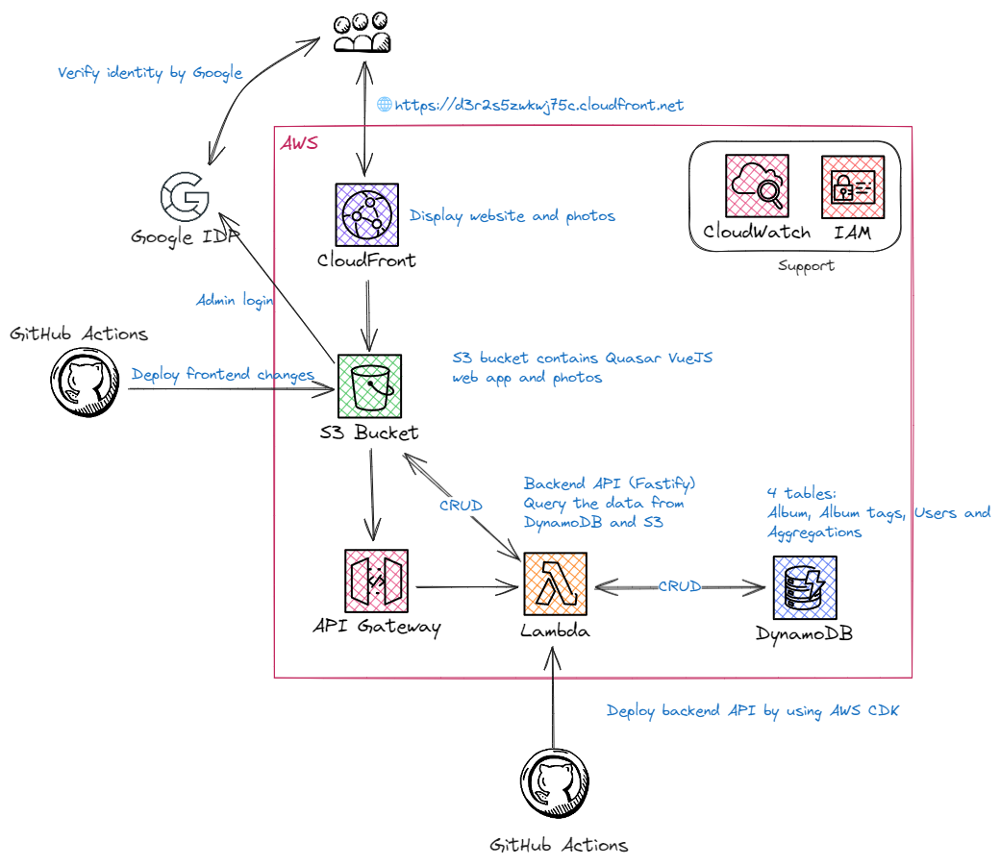

# PrimeVue photo albums web app

<!-- TABLE OF CONTENTS -->
<details>
  <summary>Table of Contents</summary>
  <ol>
    <li>
      <a href="#about-the-project">About The Project</a>
      <ul>
        <li><a href="#built-with">Built With</a></li>
        <li><a href="#architecture">Architecture</a></li>
      </ul>
    </li>
    <li>
      <a href="#getting-started">Getting Started</a>
      <ul>
        <li><a href="#prerequisites">Prerequisites</a></li>
        <li><a href="#create-s3-bucket">Create S3 bucket</a></li>
        <li><a href="#integrate-with-imagekit">Integrate with ImageKit</a></li>
        <li><a href="#mapbox-api-key">Mapbox API key</a></li>
        <li><a href="#aws-lambda-function">AWS Lambda Function</a></li>
      </ul>
    </li>
    <li>
      <a href="#how-to-run-locally">How to run locally</a>
    </li>
  </ol>
</details>

## About The Project

This is a fullstack photo album web app using Vue3, PrimeVue, Tailwind CSS, Tanstack Query, Fastify and AWS (including
API Gateway, Lambda function, S3, CloudFront and dynamoDB). You can use this web app to display your photos in S3 bucket
and manage your photos. This app is supposed to be used by a small group of people (e.g. family members) so it doesn't
have any user management feature.

I've written the detailed tutorial on dev.to, you can check [here](https://dev.to/laurenceho/a-fullstack-vuejs-photo-album-app-part-1-2bgd).

### Built With

[![Vue][Vue.js]][Vue-url][![TypeScript][typescript]][type-url][![Vite][vite]][vite-url][![Fastify][fastify]][fastify-url][![AWS][aws]][aws-url]

### Architecture



## Getting started

### Prerequisites

You will need the follows:

1. Google Place API key (For admin manage albums)
2. Google OAuth 2.0 Client ID (For admin access)
3. AWS user and role with admin permission for your local development and deployment
4. AWS S3 bucket (For SPA website hosting and storing photos. **Serverless framework will create this for you once you run serverless deploy.** )
5. AWS DynamoDB table (For managing album information. **Serverless framework will create 4 tables for you once you run serverless deploy**)
6. AWS Lambda Function with API Gateway **(Serverless framework will create these for you once you run serverless deploy)**
7. AWS CloudFront **(Serverless framework will create this for you once you run serverless deploy)**
8. ImageKit account (It's optional)
9. Mapbox API key (For displaying map)

‼️ **️Important** ‼️

Before you start local development, you will need to do serverless deploy first. Please check further
information in the `server` folder [here](server/README.md).

### After deploying Serverless Framework

After deploying Serverless Framework by running `bun run serverless:deploy`, replace properties `VITE_STATIC_FILES_URL` and
`VITE_IMAGEKIT_CDN_URL` (There are 2 `VITE_IMAGEKIT_CDN_URL` env variables, one is in the root folder, another one is in the server
folder) with the CloudFront Domain name URL in `.env.example` and modify file name to `.env`. (the URL is like
https://dq0ro94z2ck7q.cloudfront.net, you can find it from AWS console)

### Integrate with ImageKit

In order to reduce the traffic with S3 bucket (to save money!), this project integrate with ImageKit CDN. ImageKit.io
is a cloud-based image CDN with real-time image optimisation and transformation features that help you deliver perfectly
optimized images across all devices[2]. You can follow this [documentation](https://imagekit.io/blog/image-optimization-resize-aws-s3-imagekit/)
to create an account in the ImageKit. You will have 20GB bandwidth per month as a free user. Once you have your own ImageKit
URL, replace this property `VITE_IMAGEKIT_CDN_URL` with your real information in`.env.example` and modify file name to `.env`. And
use the same URL in the `server` folder.

#### Important

If you change S3 bucket name, don't forget to update the configuration in ImageKit, and AWS IAM permission for Imagekit.

### Mapbox API key

This project uses Mapbox to display the [map](https://dq0ro94z2ck7q.cloudfront.net/map/albums). You can get your own
Mapbox API key [here](https://account.mapbox.com/auth/signup/). Once you have your own Mapbox API key, replace this property `VITE_MAPBOX_API_KEY` with your
real information in `.env.example` and modify file name to `.env`.

### Google OAuth 2.0 client ID

Please check [here](https://developers.google.com/identity/protocols/oauth2) for further information. You will also need to set up OAuth consent screen. Please check [here](https://developers.google.com/identity/protocols/oauth2/openid-connect#consent-screen).
Once you have Google OAuth 2.0 client ID, replace this property `VITE_GOOGLE_CLIENT_ID` with your real information in `.env.example`
and modify file name to `.env`. And use the same client ID in the `server` folder.

#### Login UI

This project uses Google OAuth 2.0 to authenticate users. If you don't want to use Google OAuth 2.0, you will need to
implement login UI and authentication process by yourself. Once you set up Google OAuth 2.0 client ID and OAuth consent
screen, you can access login UI by going to `http://localhost:9000/login`. You will also need to add your Google account
information in the [DynamoDB table](server/README.md#aws-dynamodb) you created. If every thing is set up correctly, you should be able to login
with your Google account and see the admin features including album and photo management as below:


### AWS Lambda Function

This project uses AWS Lambda Function to handle all APIs (as BFF, backend for frontend) and authentication process
once it's deployed to AWS. When you run serverless deploy, it will create necessary Lambda Functions, API Gateway and
DynamoDB for you.

## How to run locally

### Install the dependencies

```bash
$ bun install
```

### Start the app in MSW mode (without server running)

```bash
$ bun run msw
```

### Start the app in development mode (hot-code reloading, error reporting, etc.)

```bash
$ bun run dev
```

### Lint the files

```bash
$ bun run lint
```

### Run unit tests

```bash
$ bun run test:unit
```

### Build the app for production

```bash
$ bun run build
```

### Customize the Quasar configuration

See [Configuring quasar.conf.js](https://v2.quasar.dev/quasar-cli/quasar-conf-js).

### References

1. [CORS Configuration](https://docs.aws.amazon.com/AmazonS3/latest/userguide/ManageCorsUsing.html)
2. [Optimize and resize images in AWS S3 in real-time with ImageKit](https://imagekit.io/blog/image-optimization-resize-aws-s3-imagekit/)

<!-- MARKDOWN LINKS & IMAGES -->

[Vue.js]: https://img.shields.io/badge/Vue%20js-35495E?style=for-the-badge&logo=vuedotjs&logoColor=4FC08D
[Vue-url]: https://vuejs.org/
[aws]: https://img.shields.io/badge/Amazon_AWS-FF9900?style=for-the-badge&logo=amazonaws&logoColor=white
[aws-url]: https://aws.amazon.com/
[typescript]: https://img.shields.io/badge/TypeScript-007ACC?style=for-the-badge&logo=typescript&logoColor=white
[type-url]: https://www.typescriptlang.org/
[vite]: https://img.shields.io/badge/Vite-B73BFE?style=for-the-badge&logo=vite&logoColor=FFD62E
[vite-url]: https://vitejs.dev/
[fastify]: https://img.shields.io/badge/fastify-202020?style=for-the-badge&logo=fastify&logoColor=white
[fastify-url]: https://fastify.dev/
